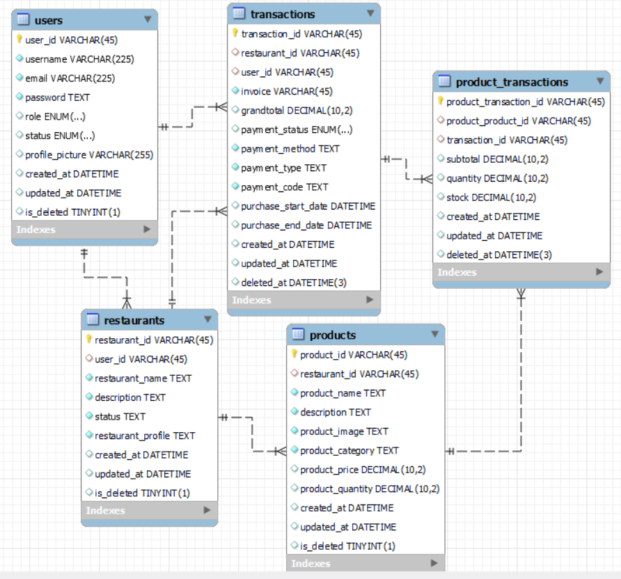

# Technical-Test-Qoin-Digital-Indonesia

### Entity Relational Diagram
Users and rooms is many to many relationship so that it would give us conjunction table : messages and members.


### How To Run
If you want to run the app locally, you can use Docker to containerize the application and also set up MySQL in Docker. This way, you can ensure consistent environments and easily manage dependencies.
You can setup MySQL by this way:
- Pull the MySQL docker image from the official docker registry instead of run a MySQL container
```
docker run --name master -p 3306:3306 -e MYSQL_ROOT_PASSWORD=@Secret123 -d mysql:latest
```

- To Access postgres you can run
```
docker exec -it master /bin/bash
```

- Than you can run
```
mysql -u root -p
```

### Authors
-   **Dimas Yudhana** - [GitHub](https://github.com/dimasyudhana)

Feel free to reach out to the authors for any inquiries.